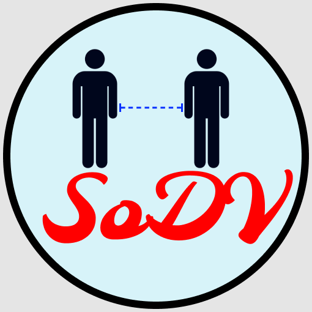

<div align="center">
  
</div>

# Social Distance Violation Detection (SoDV) using pre-trained YOLOv3 model 

The initial idea of this project is to use MobileNet SSD with Caffe implementation as the person detection algorithm. After I've finished my Final Year Project [](https://github.com/afiqharith/Social-Distancing-and-Safety-Violation-Alert-ROI-MobileNetSSD-FYP) in July 2020, I decided to further improve the detection algorithm by using YOLOv3 to increase the accuracy.
</br>

_💻 Install the dependencies on command line:_ </br>

```sh
$ pip3 install -r requirement.txt
```

_💻 To run the program on command line:_ </br>

```sh
$ python3 social-distance-yolo.py
```

</br>

### 🎬 Output example:

|  |
| ------------------------------------------ |


**At frame 225:** </br>
|  |
| -------------------------------------------- |

### 🎯 Accuracy for person detection:

| Dataset            | TP  | TN  | FP  | FN  | %    |
| ------------------ | --- | --- | --- | --- | ---- |
| Oxford Town Centre | 29  | 0   | 0   | 11  | 72.5 |

### 🎯 Accuracy for social distance violation detection:

| Dataset            | TP  | TN  | FP  | FN  | %   |
| ------------------ | --- | --- | --- | --- | --- |
| Oxford Town Centre | n/a | n/a | n/a | n/a | n/a |

### ⛔ Social distance violation detection using distance formula Drawback:

- No camera calibration for intrinsic parameter

### ⏳ Future upgrades:

| Features                                              | Status                                                                |
| ----------------------------------------------------- | --------------------------------------------------------------------- |
| Camera calibration for intrinsic parameter (distance) |  |
| Add facemask detection                                |  |

---

## Kindly check out links:

**🎥 Output video** </br>
[](https://www.youtube.com/watch?v=zXBDvDaJLHA)

**👀 YOLO Pre-Trained Model** </br>
[](https://pjreddie.com/darknet/yolo/) [](https://github.com/pjreddie/darknet.git)

**📊 Dataset** </br>
MegaPixels: Origins, Ethics, and Privacy Implications of Publicly Available Face Recognition Image Datasets </br>
[](https://megapixels.cc/)
